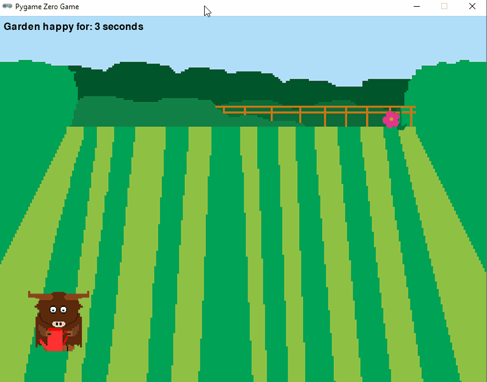

   
Happy Garden
===========
When this game starts, a cow with a watering can appears in the garden, but there is only one flower. Every few seconds another flower appears or an existing flower begins to wilt. Use the arrow keys to move the cow to the wilted flowers and press the space bar to water them. If any flower remains wilted for more than ten seconds, the game ends. But if the garden is happy for more than 15 seconds, one of the flowers mutates into a fangflower and tries to zap the cow.

Suggested steps to get started:
---------------------------------
1. Start by forking [this replit](https://replit.com/@MrSimonLowell/HappyGardenBase), or download and unzip the replit if you are working on your own PC.
2. This is the largest and most complicated project of the semester. To help keep it manageable, we'll start with an outline that labels each variable and function that we need to complete to finish the program. After each step, run your program to check for errors. *Keep your program running!*. Don't go to the next step until you've fixed the errors on the current step.
3. *More to come*

Extensions
----------------------------------------------
**Change the gardener**. In the image folder is an alternate picture of a pig with a watering can. You can use that or make a new character using any 8-bit online editor.   

**Add more flowers**. You can change how often a new flower appears on the screen to make the game easier or harder. Update the code under `def add_flowers():` to change how often it schedules a call to itself.   

**Faster fangflowers**. You can make the fangflowers move faster by changing the possible rande of `random_velocity`. Try increasing the range by using something like `randint(4,6)`.   

**Add more fangflowers**. Is the game to hard or too easy? You can change the code in `mutate()` to make fangflowers appear more or less often.   

**Add new enemies**. If you find the game is not challenging enough at the moment, you can add more enemies. 

**Rain in the garden**. What happens if it rains in the garden? The flowers will be much happier and wouldn't need watering. But they will also mutate into fanglowers more quickly. To make it look like it's raining, you can update the background with `garden-raining.png` in the images folder.

Samples of Student work
-----------------------
*none yet!*   
   
      
      
      

<i>This project is based on the book <b><a href="https://www.dk.com/us/book/9781465473615-coding-games-in-python/">Coding Games in Python</a></b></i>

