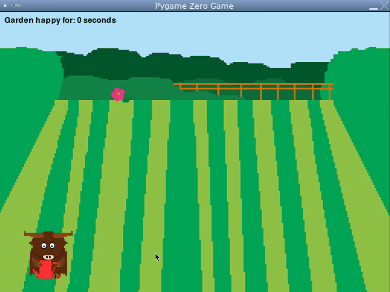

   
Happy Garden
===========
<p align="center"><i>This project was adapted from the book <b><a href="https://www.dk.com/us/book/9781465473615-coding-games-in-python/">Coding Games in Python</a></b></i></p>
When this game starts, a cow with a watering can appears in the garden, but there is only one flower. Every few seconds another flower appears or an existing flower begins to wilt. Use the arrow keys to move the cow to the wilted flowers and press the space bar to water them. If any flower remains wilted for more than ten seconds, the game ends. But if the garden is happy for more than 15 seconds, one of the flowers mutates into a fangflower and tries to zap the cow.     
   

You may find slides 348 - 390 of the [slide presentation](https://docs.google.com/presentation/d/1rICcmNbnGYsB-cV_6EatPyzcOS2sId80Jh2kayUzm4Q/edit?usp=sharing) helpful in completing this assignment. There are also video instructions:   
[Part A](http://youtu.be/SJiOUWe7DvI?hd=1)   
[Part B](http://youtu.be/7TxnWD-6ZzQ?hd=1)   
[Part C](http://youtu.be/j8oVNhG2MTM?hd=1)   
[Part D](http://youtu.be/OvaiQNLCroI?hd=1)   
[Part E](http://youtu.be/E155soflVso?hd=1)   

Suggested steps to get started:
---------------------------------
Start by forking [this replit](https://replit.com/@MrSimonLowell/HappyGardenBase), or download and unzip the replit if you are working on your own PC or Mac.

This is the largest and most complicated project of the semester. To help keep it manageable, we'll start with an outline that labels each variable and function that we need to complete to finish the program. After each step, run your program to check for errors. *Keep your program running!* Don't go to the next step until you've fixed the errors on the current step.

### A. Setting up the game and drawing the garden and cow with watering can
1. Under the comment `#screen dimension variables` add the following code:
    ```python
    #screen dimension variables
    WIDTH = 800
    HEIGHT = 600
    ```
    Under the comment `#boolean variables` add the following code:
    ```python
    #boolean variables
    game_over = False
    ```
    Then in the `draw()` function, replace the placeholder `pass` with:
    ```python
    def draw():
        global game_over
        if (not game_over):
            screen.blit("garden",(0,0))
    ```
    Run your program, you should see the garden.   

2. Next, we'll add the cow. Under the comment `#actor variables` add the following code:
    ```python
    #actor variables
    cow = Actor("cow")
    cow.pos = (100, 500)
    ```
    Then in the `draw()` function, draw the cow after the garden:
    ```python
    def draw():
        global game_over
        if (not game_over):
            screen.blit("garden",(0,0))
            cow.draw()
    ```
    Run your program, you should see the cow with the watering can in the bottom left hand corner of the garden.   

3. Now we'll make the cow move. In the `update()` function, replace the placeholder `pass` with:
    ```python
    def update():
      global game_over
      if(not game_over):
        if(keyboard.left and cow.x > 0):
          cow.x -= 5
        if(keyboard.right and cow.x < WIDTH):
          cow.x += 5
        if(keyboard.up and cow.y > 150):
            cow.y -= 5
        if(keyboard.down and cow.y < HEIGHT):
            cow.y += 5
    ```
    Run your program and click on the screen with the mouse. You should be able to move the cow around the garden with the arrow keys.   

4. Next, we'll have the cow use the watering can when we press the space bar. In the `reset_cow()` function, replace the placeholder `pass` with:
    ```python
    def reset_cow():
        global game_over
        if (not game_over):
          cow.image = "cow"
    ```
    Now add the following code to `update()`:
    ```python
    def update():
      global game_over
      if(not game_over):
        if(keyboard.space):
          cow.image = "cow-water"
          clock.schedule(reset_cow, 0.5)
        if(keyboard.left and cow.x > 0):
          cow.x -= 5
        if(keyboard.right and cow.x < WIDTH):
          cow.x += 5
        if(keyboard.up and cow.y > 150):
            cow.y -= 5
        if(keyboard.down and cow.y < WIDTH):
            cow.y += 5
    ```
    Run your program and click on the screen with the mouse. You should be able to press the space bar to have the cow use the watering can.  

### B. Adding Flowers
5. Under the comment `#list variables` add the following code:
    ```python
    #list variables
    flower_list = []
    wilted_list = []
    ```
6. In the `new_flower()` function, replace the placeholder `pass` with:
    ```python
    def new_flower():
        global flower_list, wilted_list
        flower_new = Actor("flower")
        flower_new.pos = (randint(50,WIDTH-50), randint(150,HEIGHT-100))
        flower_list.append(flower_new)
        wilted_list.append("happy")
    ```
    In the `add_flowers()` function, replace the placeholder `pass` with:
    ```python
    def add_flowers():
        global game_over
        if (not game_over):
            new_flower()
            clock.schedule(add_flowers,4)
    ```
    Then in the `draw()` function, draw the flowers after the garden and the cow:
    ```python
    def draw():
      if (not game_over):
        screen.blit("garden",(0,0))
        cow.draw()
        for flower in flower_list:
          flower.draw()
    ```
    At the bottom of the program, add `add_flowers()` just above the call to start the program `pgzrun.go()`. 
    ```python
    add_flowers()
    pgzrun.go()
    ```
    Run your program and you should see flowers appear in the garden. 
### C. Wilting Flowers
7. In the `wilt_flower()` function, replace the placeholder `pass` with:
    ```python
    def wilt_flower():
        global flower_list, wilted_list, game_over
        if (not game_over):
            if(len(flower_list) > 0): 
                rand_flower = randint(0,len(flower_list) - 1)
                if(flower_list[rand_flower].image == "flower"):
                    flower_list[rand_flower].image = "flower-wilt"
                    wilted_list[rand_flower] = time.time()
            clock.schedule(wilt_flower,3)
    ```
    At the bottom of the program, add `wilt_flower()` just above the call to start the program `pgzrun.go()`. 
    ```python
    add_flowers()
    wilt_flower()
    pgzrun.go()  
    ```
    Run your program and you should see flowers appear and randomly wilt in the garden. 
    
### D. Watering Flowers
8. In the `check_flower_collision()` function, replace the placeholder `pass` with:
    ```python
    def check_flower_collision():
        global cow, flower_list, wilted_list, game_over
        index = 0
        for flower in flower_list:
            if(flower.colliderect(cow) and flower.image == "flower-wilt"):
                flower.image = "flower"
                wilted_list[index] = "happy"
                break
            index = index + 1
    ```
    At the bottom of the `if(keyboard.space):`, in `update()` call `check_flower_collision`. 
    ```python
    def update():
        global game_over
            if(not game_over):
                if(keyboard.space):
                  cow.image = "cow-water"
                  clock.schedule(reset_cow, 0.5)
                  check_flower_collision()
                if(keyboard.left and cow.x > 0):
                  cow.x -= 5
                if(keyboard.right and cow.x < WIDTH):
                  cow.x += 5
                if(keyboard.up and cow.y > 150):
                    cow.y -= 5
                if(keyboard.down and cow.y < WIDTH):
                    cow.y += 5 
    ```
    Run your program and the cow should be able to revive the wilted flowers by watering them. 
    
### E. Ending the game
9. Under the comments `#boolean variables` and `#time variables` add the following code:
    ```python
    #boolean variables
    game_over = False
    finalized = False
    garden_happy = True

    #time variables
    time_elapsed = 0
    start_time = time.time()
    ```
10. In the `check_wilt_times()` function, replace the placeholder `pass` with:
    ```python
    def check_wilt_times():
        global wilted_list, game_over, garden_happy
        if(len(wilted_list)>0):
            for wilted_since in wilted_list:
                if(not wilted_since == "happy"):
                    time_wilted = int(time.time() - wilted_since)
                    if(time_wilted > 10.0):
                        garden_happy = False
                        game_over = True
                        break
    ```
11. in `update()` call `check_wilt_times()` and add `time_elasped` to the list of `global` variables:
    ```python
    def update():
      global game_over, time_elapsed
      check_wilt_times()
      if(not game_over):
        if(keyboard.space):
          cow.image = "cow-water"
          clock.schedule(reset_cow, 0.5)
          check_flower_collision()
        if(keyboard.left and cow.x > 0):
          cow.x -= 5
        if(keyboard.right and cow.x < WIDTH):
          cow.x += 5
        if(keyboard.up and cow.y > 150):
            cow.y -= 5
        if(keyboard.down and cow.y < WIDTH):
            cow.y += 5
    ```
    
12. Add an `else` to the `if(not game_over)` in draw:
    ```python
    def draw():
        global game_over, time_elapsed, finalized
        if (not game_over):
            screen.clear()
            screen.blit("garden",(0,0))
            cow.draw()
            for flower in flower_list:
                flower.draw()
            time_elapsed = int(time.time() - start_time)
            screen.draw.text("Garden happy for: " + str(time_elapsed)
                             + " seconds",topleft=(10,10),color="black")
        else:
            if (not finalized):
                cow.draw()
                screen.draw.text("Garden happy for: " + str(time_elapsed)
                             + " seconds",topleft=(10,10),color="black")
                if(not garden_happy):
                    screen.draw.text("GARDEN UNHAPPY-GAME OVER!",topleft=(10,50),color="black")
                    finalized = True
    ```
    Run your program. If any flower stays wilted for 10 seconds, you should see a game over message.
### F. Adding fangflowers

13. Under the comments `#boolean variables` add a `fangflower_collision` boolean:
    ```python
    #boolean variables
    game_over = False
    finalized = False
    garden_happy = True
    fangflower_collision = False
    ```

    Under the comments `#list variables` add three variables:
    ```python
    #list variables
    flower_list = []
    wilted_list = []
    fangflower_list = []
    fangflower_vx_list = []
    fangflower_vy_list = []
    ```

    Add a loop in `draw()` to draw the fangflowers and an `else` to end the game if there is a fangflower attack:
    ```python
    def draw():
        global game_over, time_elapsed, finalized
        if (not game_over):
            screen.clear()
            screen.blit("garden",(0,0))
            cow.draw()
            for flower in flower_list:
                flower.draw()
            for fangflower in fangflower_list:
                fangflower.draw()
            time_elapsed = int(time.time() - start_time)
            screen.draw.text("Garden happy for: " + str(time_elapsed)
                             + " seconds",topleft=(10,10),color="black")
        else:
            if (not finalized):
                cow.draw()
                screen.draw.text("Garden happy for: " + str(time_elapsed)
                             + " seconds",topleft=(10,10),color="black")
                if(not garden_happy):
                    screen.draw.text("GARDEN UNHAPPY-GAME OVER!",topleft=(10,50),color="black")
                    finalized = True
                else:
                    screen.draw.text("FANGFLOWER ATTACK-GAME OVER!",topleft=(10,50),color="black")
                    finalized = True
    ```
    In the `check_fangflower_collision()` function, replace the placeholder `pass` with:
     ```python
    def check_fangflower_collision():
        global game_over
        for fangflower in fangflower_list:
            if(fangflower.colliderect(cow)):
               cow.image = "zap"
               game_over = True
               break
    ```
    In the `velocity()` function, replace the placeholder `pass` with:
    ```python
    def velocity():
        random_dir = randint(0,1)
        random_velocity = randint(2,3)
        if(random_dir == 0):
            return -random_velocity
        else:
            return random_velocity
    ```
    In the `mutate()` function, replace the placeholder `pass` with:
    ```python
    def mutate():
        if (not game_over and len(flower_list) > 0):
            rand_flower = randint(0, len(flower_list) - 1)
            fangflower_pos_x = flower_list[rand_flower].x
            fangflower_pos_y = flower_list[rand_flower].y
            del flower_list[rand_flower]
            fangflower = Actor("fangflower")
            fangflower.pos = fangflower_pos_x, fangflower_pos_y
            fangflower_vx = velocity()
            fangflower_vy = velocity()
            fangflower = fangflower_list.append(fangflower)
            fangflower_vx_list.append(fangflower_vx)
            fangflower_vy_list.append(fangflower_vy)
            clock.schedule(mutate, 20)
    ```
    In the `update_fangflowers()` function, replace the placeholder `pass` with:
    ```python
    def update_fangflowers():
        if(not game_over):
            index = 0
            for fangflower in fangflower_list:
                fangflower_vx = fangflower_vx_list[index]
                fangflower_vy = fangflower_vy_list[index]
                fangflower.x = fangflower.x + fangflower_vx
                fangflower.y = fangflower.y + fangflower_vy
                if(fangflower.left < 0):
                    fangflower_vx_list[index] = -fangflower_vx
                if(fangflower.right > WIDTH):
                    fangflower_vx_list[index] = -fangflower_vx
                if(fangflower.top < 150):
                    fangflower_vy_list[index] = -fangflower_vy
                if(fangflower.bottom > HEIGHT):
                    fangflower_vy_list[index] = -fangflower_vy
                index = index + 1
    ```
    In the `update()` function, add `fangflower_collision` to the list of `global` variables and assign it the result of calling `check_fangflower_collision`, an `if` statement to mutate flowers into fangflowers and a call to `update_fangflowers()` :
    ```python
    def update():
      global game_over
      fangflower_collision = check_fangflower_collision()
      check_wilt_times()
      if(not game_over):
        if(keyboard.space):
          cow.image = "cow-water"
          clock.schedule(reset_cow, 0.5)
          check_flower_collision()
        if(keyboard.left and cow.x > 0):
          cow.x -= 5
        if(keyboard.right and cow.x < WIDTH):
          cow.x += 5
        if(keyboard.up and cow.y > 150):
            cow.y -= 5
        if(keyboard.down and cow.y < WIDTH):
            cow.y += 5
        if(time_elapsed > 15 and len(fangflower_list)==0):
            mutate()
        update_fangflowers()
    ```
    You should now have a working program!

Extensions
----------------------------------------------
**Add sounds**. Create a `sounds` folder like the one in the previous assingment. Play appropriate sounds for each action in the game. Unfortunately, replit doesn't support sounds in Pygame.  

**Change the gardener**. In the image folder there is an alternate picture of a pig with a watering can. You can use that or make a new character using any 8-bit online editor.   

**Add more flowers**. You can change how often a new flower appears on the screen to make the game easier or harder. Update the code under `def add_flowers():` to change how often it schedules a call to itself.   

**Faster fangflowers**. You can make the fangflowers move faster by changing the possible range of `random_velocity`. Try increasing the range by using something like `randint(4,6)`.   

**Add more fangflowers**. Is the game to hard or too easy? You can change the code in `mutate()` to make fangflowers appear more or less often.   

**Add new enemies**. If you find the game is not challenging enough at the moment, you can add more enemies. 

**Rain in the garden**. What happens if it rains in the garden? The flowers will be much happier and wouldn't need watering. But they will also mutate into fanglowers more quickly. To make it look like it's raining, you can update the background with `garden-raining.png` in the images folder.

Samples of Student work
-----------------------
*none yet!*   
   
      
      
      
